# Spring Security Tutorial

## Spring Security Internal Flow
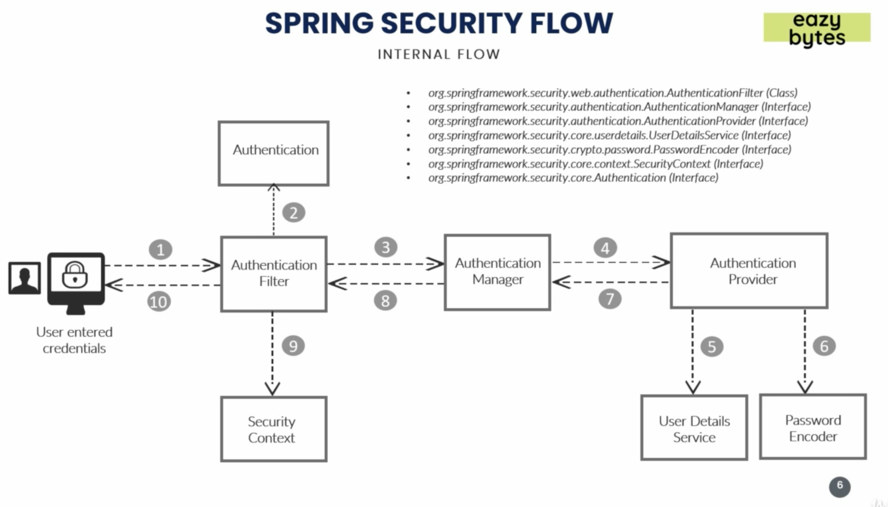
* AuthenticationFilter - intercepts and performs authentication of particular request
* Authentication - using the supplied username and password from the user, authentication object is formed which is 
    passed into Authentication Manager
* AuthenticationManager - once received request from filter, it passes it on to AuthenticationProvider after validating
    the user details
* AuthenticationProvider -  It has all the logic of validating user details using UserDetailsService and PasswordEncoder.
* UserDetailsService - UserDetailsService retrieves UserDetails and implements the User interface using the supplied 
    username.
* PasswordEncoder - Service interface for encoding passwords.
* SecurityContext - Stores the authentication data after successful authentication. The second time the user sends 
    the same request, it will not have to go through this entire loop again.

## What we will be building
### FrontEnd
* Login, notices, and contact-us pages should be visible to the user without logging in
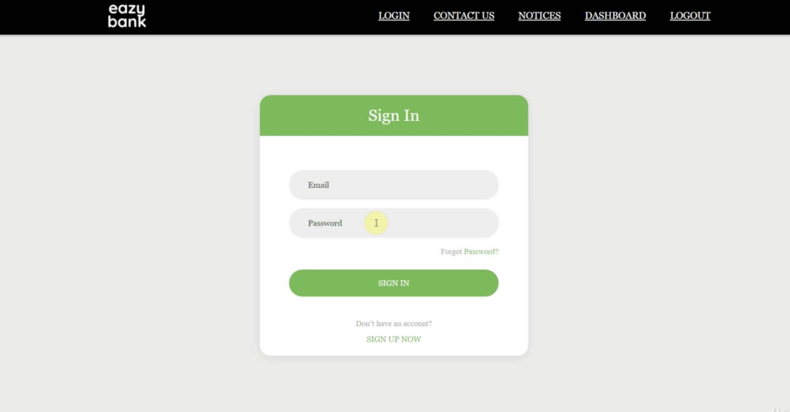
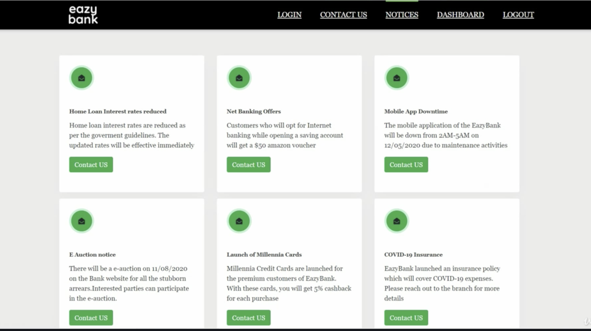
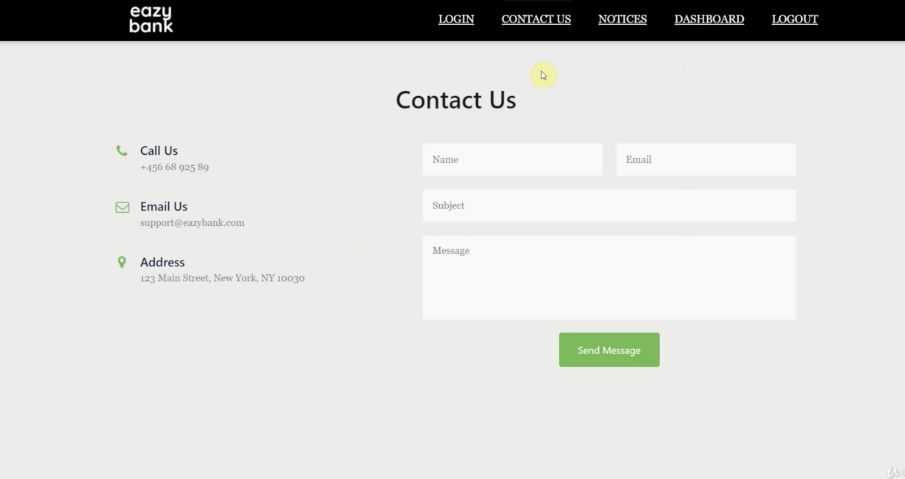
* Dashboard: account info, balances, loans, and cards should be secured
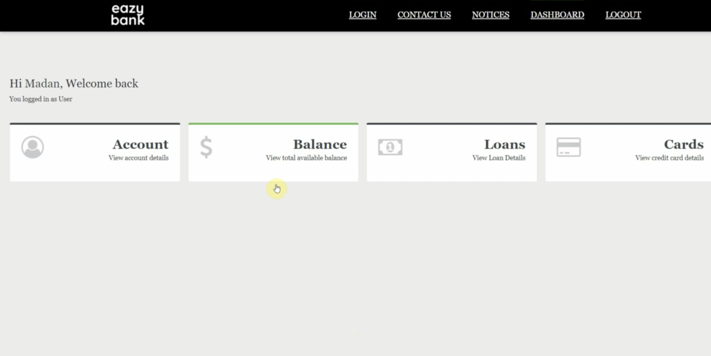
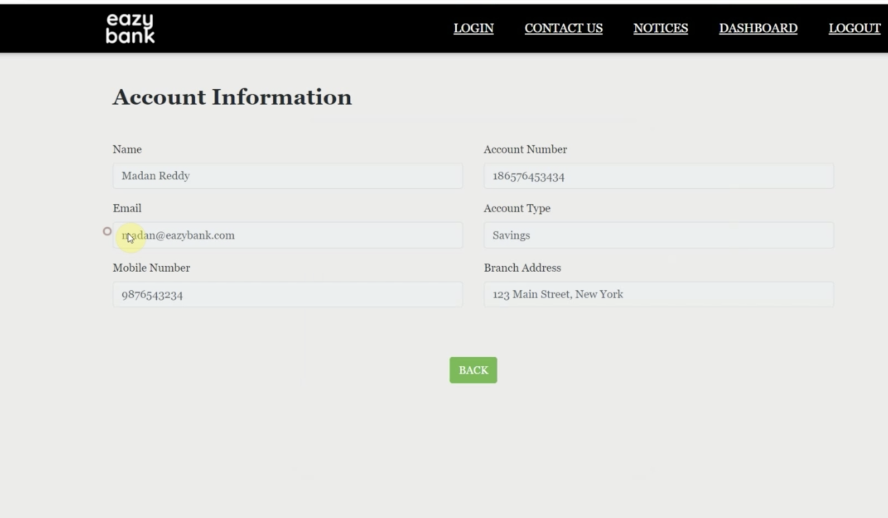
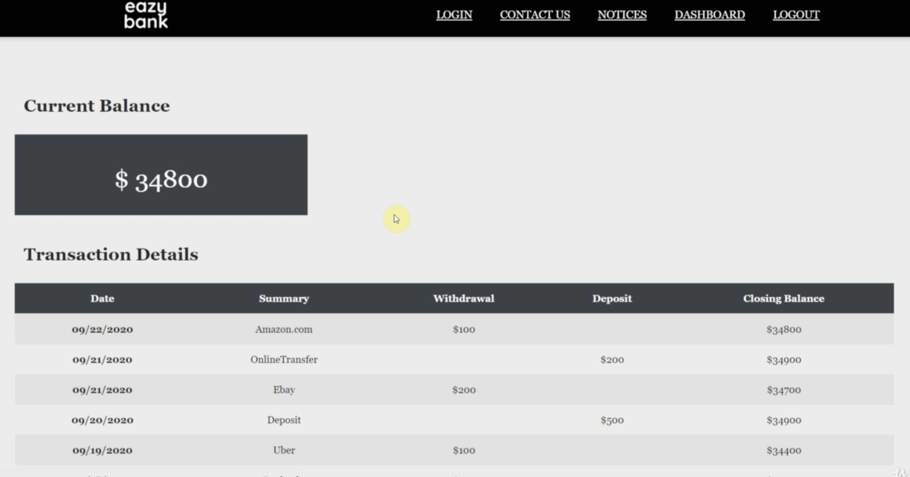
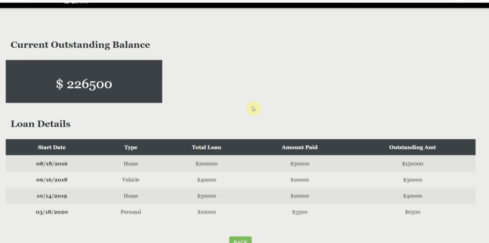
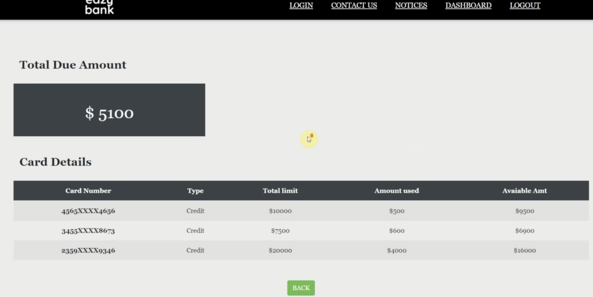

### BackEnd
* Services without any security
    * /contact – This service should accept the details from the Contact Us page in the UI and save to the DB.
    * /notices – This service should send the notice details from the DB to the ‘NOTICES’ page in the UI

* Services with security
    * /myAccount – This service should send the account details of the logged in user from the DB to the UI
    * /myBalance – This service should send the balance and transaction details of the logged in user from the DB to
    the UI
    * /myLoans – This service should send the loan details of the logged in user from the DB to the UI
    * /myCards – This service should send the card details of the logged in user from the DB to the UI
    
## Step By Step Guide
* Go to start.spring.io and create a new project. Add SpringWeb and SpringSecurity depenedencies to it.
* Create a separate package for controllers (Need to add @ComponentScan). Add all the rest controllers. (Rest Services)
    * @GetMapping <- reading data from the database
    * @PostMapping <- reading data and saving to the DB 
* By default, Spring Security will secure all the requests made within the application. However as mentioned above, our
    requirements are different (i.e we shouldn't secure /contact and /notices).
    * You can go to Postman, create a request and see it yourself. 
* To override the default behavior, we need to create a config class that extends `WebSecurityConfigurerAdapter` and 
    override its `configure(HttpSecurity http)` class.
    * `WebSecurityConfigurerAdapter` <- base class for entire spring security.
```java
@Configuration
public class ProjectSecurityConfig extends WebSecurityConfigurerAdapter {
        @Override
        protected void configure(HttpSecurity http) throws Exception {
        /*
            Default configuration which secures all the requests
         */

        http.authorizeRequests((requests) -> {
            ((ExpressionUrlAuthorizationConfigurer.AuthorizedUrl)requests.anyRequest()).authenticated();
        });
        http.formLogin();
        http.httpBasic();


        /*
            Custom configuration as per our requirements.
         */

//        http.authorizeRequests((requests) -> {
//            ((ExpressionUrlAuthorizationConfigurer.AuthorizedUrl)requests.antMatchers("/myAccount")).authenticated();
//            ((ExpressionUrlAuthorizationConfigurer.AuthorizedUrl)requests.antMatchers("/myLoans")).authenticated();
//            ((ExpressionUrlAuthorizationConfigurer.AuthorizedUrl)requests.antMatchers("/myCards")).authenticated();
//            ((ExpressionUrlAuthorizationConfigurer.AuthorizedUrl)requests.antMatchers("/myBalance")).authenticated();
//            ((ExpressionUrlAuthorizationConfigurer.AuthorizedUrl)requests.antMatchers("/contact")).permitAll();
//            ((ExpressionUrlAuthorizationConfigurer.AuthorizedUrl)requests.antMatchers("/notices")).permitAll();
//        });
//        http.formLogin();
//        http.httpBasic();

        /*
            Configuration to deny all requests for all users regardless if they are authenticated or not authenticated.
            Forbidden Error.
         */

//        http.authorizeRequests((requests) -> {
//            ((ExpressionUrlAuthorizationConfigurer.AuthorizedUrl)requests.anyRequest()).denyAll();
//        });
//        http.formLogin();
//        http.httpBasic();  


        /*
            Configuration to permit all requests for all users.
         */

//        http.authorizeRequests((requests) -> {
//            ((ExpressionUrlAuthorizationConfigurer.AuthorizedUrl)requests.anyRequest()).permitAll();
//        });
//        http.formLogin();
//        http.httpBasic(); 
        }
}
```

## User Details Service and Password Encoder
* Have to override another method `configure(AuthenticationManagerBuilder auth)` of `WebSecurityConfigurerAdapter`
* `configure(AuthenticationManagerBuilder auth)` is used to customize user, user details, password encoder, along with Authentication Provider
### Configuring Multiple Users using InMemoryAuthentication 
```java
@Configuration
public class ProjectSecurityConfig extends WebSecurityConfigurerAdapter {
    @Override
    protected void configure(AuthenticationManagerBuilder auth) throws Exception {
        auth.inMemoryAuthentication().withUser("admin").password("1234").authorities("admin").and()
                .withUser("user").password("1234").authorities("read").and()
                .passwordEncoder(NoOpPasswordEncoder.getInstance()); 
        // authenticating multiple users
        // passwordEncoder is a must have or else spring will throw an error
        // NoOpPasswordEncoder is not recommended
        // user created inside application.properties won't work anymore because we have created our own set of user here.
    }
}
```
### Configuring Multiple Users using InMemoryUserDetailsManager
* This is called InMemoryUserDetailsManager because the users are managed within the Spring Container. 
```java
@Configuration
public class ProjectSecurityConfig extends WebSecurityConfigurerAdapter {

    @Override
    protected void configure(AuthenticationManagerBuilder auth) throws Exception {
        InMemoryUserDetailsManager userDetailsService = new InMemoryUserDetailsManager();
        UserDetails adminUser = User.withUsername("admin").password("1234").authorities("admin").build();
        UserDetails user = User.withUsername("user").password("1234").authorities("read").build();
        userDetailsService.createUser(adminUser);
        userDetailsService.createUser(user);
        auth.userDetailsService(userDetailsService);
    }

    @Bean
    public PasswordEncoder passwordEncoder() {
        return NoOpPasswordEncoder.getInstance();
    }
}
```

## User Management: Important Interfaces and Classes
* You can view source codes of these interfaces and classes by typing appropriate name inside any java class and pressing Command + Click.
* Interfaces
    * UserDetails - base interface
    * UserDetailsService - if we only need to read users from database
    * UserDetailsManager - if need to create, update, delete users in database
* Classes (these classes are already provided by Spring Framework)
    * InMemoryUserDetailsManager - users are managed within Spring container/context. Used only for demo purposes.
    * JdbcUserDetailsManager - Ideal for when interacting with databases such as MySQL, Oracle, MongoDB, etc. (Has production-ready features and thus is used in production.)
    * LdapUserDetailsManager - if you have a requirement where users are maintained inside Ldap Server
* If for any reason, if these classes doesn't match your requirement, you can implement `UserDetailsManager` and override 
    all the methods based on your own requirement
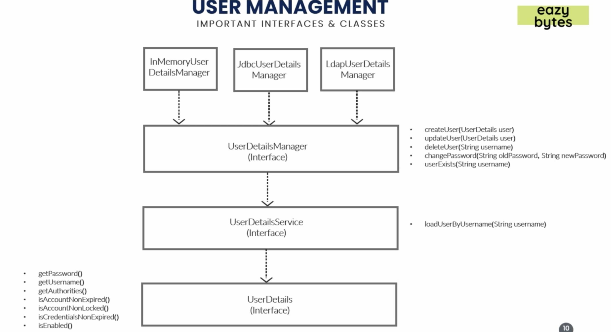

### Configuring Users using JdbcUserDetailsManager
* the columns in the DB table and the instance variables of JdbcUserDetailsManager must be the same.
    * Tables:
        * users
            * columns
                * username
                * password
                * enabled (boolean(true/false)/int(1/0))
        * authorities 
            * columns
                * username
                * authority
* have to add required maven dependencies
```xml
<dependencies>
    <dependency>
        <groupId>org.springframework.boot</groupId>
        <artifactId>spring-boot-starter-jdbc</artifactId>
    </dependency>
    <dependency>
        <groupId>mysql</groupId>
        <artifactId>mysql-connector-java</artifactId>
        <scope>runtime</scope>
    </dependency>
    <dependency>
        <groupId>org.springframework.boot</groupId>
        <artifactId>spring-boot-starter-data-jpa</artifactId>
    </dependency>
</dependencies>
```
* have to configure datasource url, datasource username and datasource password inside applictation.properties
```properties
# this is not recommended for production ready applications
spring.datasource.url=jdbc:mysql://localhost:3306/spring_security_users
spring.datasource.username=spring_security
spring.datasource.password=spring_security
```
* create tables users and authorities inside your database
```sql
CREATE TABLE `users` (
`id` INT NOT NULL AUTO_INCREMENT,
`username` VARCHAR(45) NOT NULL,
`password` VARCHAR(45) NOT NULL,
`enabled` INT NOT NULL,
PRIMARY KEY (`id`));

CREATE TABLE `authorities` (
  `id` int NOT NULL AUTO_INCREMENT,
  `username` varchar(45) NOT NULL,
  `authority` varchar(45) NOT NULL,
  PRIMARY KEY (`id`));
```
* insert data inside the tables you created  
```sql
INSERT IGNORE INTO `users` VALUES (NULL, 'happy', '12345', '1');
INSERT IGNORE INTO `authorities` VALUES (NULL, 'happy', 'write');
```          
* have to configure a `JdbcUserDetailsManager` Bean and a passwordEncoder Bean (which will be created and stored inside Spring Context on startup) so that Spring knows which UserDetailsService and Password Encoder to use.
```java
@Configuration
public class ProjectSecurityConfig extends WebSecurityConfigurerAdapter {
   @Bean
   // dataSource is created with the datasource that we provided in application.properties
   public UserDetailsService userDetailsService(DataSource dataSource) {
       return new JdbcUserDetailsManager(dataSource);
   }

   @Bean
   public PasswordEncoder passwordEncoder() {
       return NoOpPasswordEncoder.getInstance();
   }
}
```  
* You are now ready to run the program. You can see it yourself that the method `loadUsersByUsername()` inside `JdbcUserDetailsManager` is ran by setting breakpoints.   
* See [Configuring Custom Users](#configuring-users-using-your-own-custom-implementation-of-userdetailsservice-or-userdetailsmanager) if your requirements are different.

### Configuring Users using your own custom implementation of UserDetailsService or UserDetailsManager
*  Create a table and insert data inside your DB
```sql
CREATE TABLE `customer` (
  `id` int NOT NULL AUTO_INCREMENT,
  `email` varchar(45) NOT NULL,
  `pwd` varchar(45) NOT NULL,
  `role` varchar(45) NOT NULL,
  PRIMARY KEY (`id`)
);

INSERT INTO `customer` (`email`, `pwd`, `role`)
 VALUES ('johndoe@example.com', '54321', 'admin');
```
* Create a model named Customer. You can name your model to whatever you want, however if you do so, you also have to add `@Table(name= "customer")` annotation.
* Its private instance variables should match the columns in the Customer table. If not, you will have to add `@Column(name="<correspondingColumnName>")`
```java
package com.springsecurity.model;
@Entity
public class Customer {
    @Id
    @GeneratedValue(strategy = GenerationType.AUTO)
    private int id;
    private String email;
    private String pwd;
    private String role;
// getters and setters..    
}
```
* Also, need to add a repository that extends CrudRepository<Customer, Long> or JpaRepository<Customer, Long>
* The beauty of JpaRepository: you don't have to explicitly provide implementation of Jpa Repository Methods. 
    * When we extend the class, it will already know that Customer is a table name.
    * findBy<instanceVariables>() - Jpa will internally provide implementation for this.
        * can also have findBy<instanceVariables>and<anotherInstanceVariable>() - Jpa is smart enough to know this.
```java
package com.springsecurity.repositories;
@Repository
public interface CustomerRepository extends CrudRepository<Customer, Long> {
    List<Customer> findByEmail(String email);
}
```
* Here we know that Customer is our `UserDetail`, however, Spring Security doesn't know that yet.
* So, we always need to make the user representation of the Customer table by creating a class which implements `UserDetails` interface.
* SecurityCustomer - user representation of Customer table
```java
package com.springsecurity.model;
public class SecurityCustomer implements UserDetails {
    private static final long serialVersionUID = -6690946490872875352L;
    private final Customer customer;
    public SecurityCustomer(Customer customer) {
        this.customer = customer;
    }
    @Override
    public Collection<? extends GrantedAuthority> getAuthorities() {
        List<GrantedAuthority> authorities = new ArrayList<>();
        authorities.add(new SimpleGrantedAuthority(customer.getRole()));
        return authorities;
    }
    @Override
    public String getPassword() {
        return customer.getPwd();
    }
    @Override
    public String getUsername() {
        return customer.getEmail();
    }
    @Override
    public boolean isAccountNonExpired() {
        return true;
    }
    @Override
    public boolean isAccountNonLocked() {
        return true;
    }
    @Override
    public boolean isCredentialsNonExpired() {
        return true;
    }
    @Override
    public boolean isEnabled() {
        return true;
    }
}
```
* Finally, we need `UserDetailsService`. We can achieve this by creating a class which implements `UserDetailsService` or `UserDetailsManager` depending on your requirements.
    * `UserDetailsService` - if we only need to read users from database
    * `UserDetailsManager` - if need to create, update, delete users in database
* Here is a demo where I use `UserDetailsService` but you can also do the same with `UserDetailsManager`
```java
package com.springsecurity.config;
@Service
public class BankUserDetails implements UserDetailsService {
    @Autowired
    private CustomerRepository customerRepository;
    @Override
    public UserDetails loadUserByUsername(String username) throws UsernameNotFoundException {
        List<Customer> customer = customerRepository.findByEmail(username);
        if (customer.size() == 0) {
            throw new UsernameNotFoundException("User details not found for the user: " + username);
        }
        return new SecurityCustomer(customer.get(0));
    }
}
```
* With that, you are ready to go. Run the application and see it yourself!

## Password Management with PasswordEncoders
* By default, spring takes the user login credentials and retrieves all the user details from the DB to check if the 
user login matches with the existing user details in the DB.
* This approach has following issues:
    * Integrity issues - someone else can access my logins and log into my accounts because they are stored as plain text inside the DB 
    * Confidentiality - sending plain text passwords over the networks. Someone else can see my password if they try to intercept.
* Not recommended for applications with sensitive data 
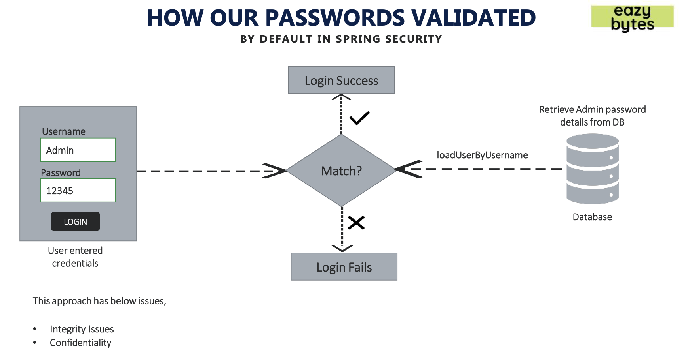
* To solve this issue, we should be encoding, encrypting or hashing the passwords
### Encoding Vs Encrypting Vs Hashing
#### Encoding
* Defined as the process of converting from one form to the another
* It guarantees none of 3 cryptographic properties of confidentiality, integrity, and authenticity because it involves no secret and is completely reversible.
* Encoding can be used for reducing the size of audio and video files. For ex. decoding to binary and encoding it back to audio when reading back.
* It can’t be used for securing data, various publicly available algorithms are used for encoding.
* Examples: ASCII, BASE64, UNICODE

#### Encrypting
* Defined as the process of transforming data in such a way that guarantees confidentiality. To achieve that, encryption requires the use of a secret which, in cryptographic terms, we call a “key”.
* Encryption is divided into two categories: symmetric and asymmetric, where the major difference is the number of keys needed.
##### Symmetric Encryption
* In symmetric encryption algorithms, a single secret (key) is used to both encrypt and decrypt data. 
* Only those who are authorized to access the data should have the single shared key in their possession.
* Example: file system encryption, database encryption e.g. credit card details, contact details, etc (but not password)
##### Asymmetric Encryption
* In asymmetric encryption algorithms, there are two keys in use: one public and one private. 
* As their names suggest, the private key must be kept secret, whereas the public can be known to everyone. 
* When applying encryption, the public key is used, whereas decrypting requires the private key. 
* Anyone should be able to send us encrypted data, but only we should be able to decrypt and read it!
* Example: TLS, VPN, SSH
#### Hashing (used for password management)
* In hashing, data is converted to the hash using some hashing function, which can be any number generated from string or text. Various hashing algorithms are MD5, SHA256. Data once hashed is **non-reversible**.
* One cannot determine the original data given only the output of a hashing algorithm.
* Given some arbitrary data along with the output of a hashing algorithm, *one can verify whether this data matches the
  original input data without needing to see the original data*
* You may have heard of hashing used in the context of passwords. Among many uses of hashing algorithms, this is one of the most well-known. When you sign up on a web app using a password, rather than storing your actual password, which would not only be a violation of your privacy but also a big risk for the web app owner, the web app hashes the password and stores only the hash. 
Then, the next time you log in, the web app again hashes your password and compares this hash with the hash stored earlier. If the hashes match, the web app can be confident that you know your password even though the web app doesn’t have your actual password in storage
* Example: Password management, verify the integrity of the downloaded file

### How the passwords are validated
* By using some hashing algorithms which is determined by PasswordEncoder in Spring Security
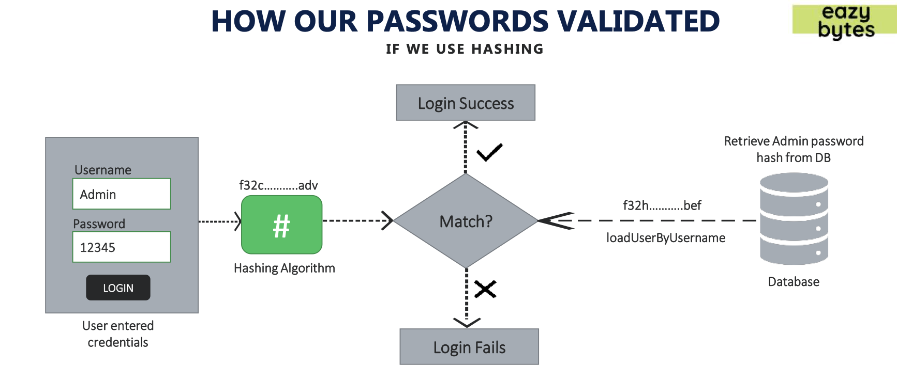

### Password Encoder Definition
```java
public interface PasswordEncoder {
    String encode(CharSequence rawPassword);

    boolean matches(CharSequence rawPassword, String encodedPassword);

    default boolean upgradeEncoding(String encodedPassword) {
        return false;
    }
}
```
#### Different Implementations of PasswordEncoders provided by Spring Security
* [NoOpPasswordEncoder](#nooppasswordencoder)
* [StandardPasswordEncoder](#standardpasswordencoder)
* [Pbkdf2PasswordEncoder](#pbkdf2passwordencoder)
* [BCryptPasswordEncoder](#bcryptpasswordencoder)
* [SCryptPasswordEncoder](#scryptpasswordencoder)
##### NoOpPasswordEncoder
* Not recommended
```java
package org.springframework.security.crypto.password;
public final class NoOpPasswordEncoder implements PasswordEncoder {
    private static final PasswordEncoder INSTANCE = new NoOpPasswordEncoder();

    private NoOpPasswordEncoder() {
    }

    public String encode(CharSequence rawPassword) {
        return rawPassword.toString();
    }

    public boolean matches(CharSequence rawPassword, String encodedPassword) {
        return rawPassword.toString().equals(encodedPassword);
    }

    public static PasswordEncoder getInstance() {
        return INSTANCE;
    }
}
```
##### StandardPasswordEncoder 
* Uses SHA-256 algorithm. Used in legacy applications.
* Not recommended as the algorithm is reversible
##### Pbkdf2PasswordEncoder
* Password-Based Key Derivation Function 2 (PBKDF2) is a pretty easy slow-hashing function that performs an HMAC (Hashed Message Authentication Code) as many times as specified by an iterations argument.
* The three parameters received by the last call are the value of a key used for the encoding process, the number of iterations used to encode the password, and the size of the hash. The second and third parameters can influence the strength of the result.
* You can choose more or fewer iterations as well as the length of the result. The longer the hash, the more powerful the password is.
    * PasswordEncoder p = new Pbkdf2PasswordEncoder();
    * PasswordEncoder p = new Pbkdf2PasswordEncoder("secret"); PasswordEncoder p = new Pbkdf2PasswordEncoder("secret", 185000, 256);
##### BCryptPasswordEncoder
* Recommended and most used. Cannot decrypt once encrypted.
* BCryptPasswordEncoder uses a BCrypt strong hashing function to encode the password. 
* You could instantiate the BCryptPasswordEncoder by calling the no-arguments constructor. 
* But you also have the option to specify a strength coefficient representing the log rounds used in the encoding process. 
* Moreover, you can as well alter the SecureRandom instance used for encoding.
```java
public class WaysOfInstantiatingBCryptPasswordEncoder {
    PasswordEncoder p = new BCryptPasswordEncoder();
    PasswordEncoder p = new BCryptPasswordEncoder(4);
    SecureRandom s = SecureRandom.getInstanceStrong();
    PasswordEncoder p = new BCryptPasswordEncoder(4, s);
}
```
##### SCryptPasswordEncoder
* Recommended
* SCryptPasswordEncoder uses a SCrypt hashing function to encode the password. 
* For the SCryptPasswordEncoder, you have two options to create its instances:
```java
public class WaysOfInstantiatingSCryptPasswordEncoder {
    PasswordEncoder p = new SCryptPasswordEncoder();
    PasswordEncoder p = new SCryptPasswordEncoder(16384, 8, 1, 32, 64);
}
```

#### Implementing our application with BCryptPasswordEncoder
* This will cause an error, since we don't have a password encrypted with BCryptPasswordEncoder in our database.
* To add a BCryptPasswordEncoder in the DB, we can use [Online BCrypt Generator](https://bcrypt-generator.com) to generate our password and add it to the DB.
```sql
CREATE TABLE `customer` (
  `id` int NOT NULL AUTO_INCREMENT,
  `email` varchar(45) NOT NULL,
  `pwd` varchar(200) NOT NULL,
  `role` varchar(45) NOT NULL,
  PRIMARY KEY (`id`)
);

INSERT INTO `customer` (`email`, `pwd`, `role`)
 VALUES ('exampleName', '$2y$12$FdRFOtqkcz46uUpQp1.PDOkhheIL.NQq3mVL4R0jSzFOPAA1IDMK6', 'admin');
```
* After adding to the DB, you are ready to go!
```java
@Configuration
public class ProjectSecurityConfig extends WebSecurityConfigurerAdapter {
   @Bean
   // dataSource is created with the datasource that we provided in application.properties
   public UserDetailsService userDetailsService(DataSource dataSource) {
       return new JdbcUserDetailsManager(dataSource);
   }

   @Bean
   public PasswordEncoder passwordEncoder() {
       return new BCryptPasswordEncoder();
   }
}
``` 

* If you want to implement your own Password encoder, you can do so by implementing PasswordEncoder Interface
 
 ## Understanding AuthenticationProvider and AuthenticationManager
 
 ### AuthenticationManager Definition
 * AuthenticationProvider is the one which does the actual authentication logic which is why we need the support method in scenarios where we need multiple authentication logics.
 * AuthenticationManager's job is to delegate the Authentication object to corresponding Authentication logic.
 ```java
package org.springframework.security.authentication;
public interface AuthenticationManager {
    Authentication authenticate(Authentication var1) throws AuthenticationException;
}
```
* Look at its implementation, ProviderManager, as an example of how the authenticate method is implemented. 
 ### AuthenticationProvider Definition
 * We implement the authenticate() method to define the authentication logic.
 * The second method in the AuthenticationProvider interface is supports(Class<?> authentication). You’ll implement this method to return true if the current AuthenticationProvider supports the type provided as the Authentication object.
    * As an example, if we want to call this authenticate method only when we are authenticaating via user's face recognition, this would be the method to decide whether this authenticate method should be called or not.
 ```java
package org.springframework.security.authentication;
public interface AuthenticationProvider {
    Authentication authenticate(Authentication var1) throws AuthenticationException;

    boolean supports(Class<?> var1);
}
```
 ### Why do we need it?
 * The AuthenticationProvider in Spring Security takes care of authentication logic.
 * The default implementation of the AuthenticationProvider delegates the responsibility of finding the user in the system to a UserDetailsService and PasswordEncoder for password validation.
 * What if we need add finger print recognition or face recognition or OTP Code to our authentication logic?
 * If we have a custom authentication requirement that is not fulfilled by Spring Security framework then we can build our own authentication logic by implementing the AuthenticationProvider interface.
 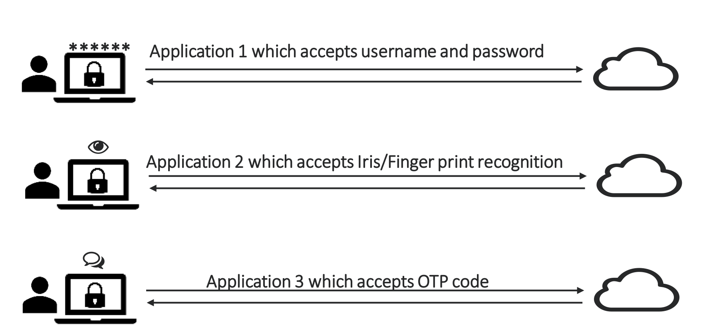
 
 ### Understanding `Authentication` object
 * `Authentication` and `UserDetails` maintain similar user details, yet they exist because Spring Security wants to give you the flexibility in each and every layer
 * UserDetailsService and UserDetailsManager leverages UserDetails whereas AuthenticationProvider and AuthenticationManager uses Authentication object.
 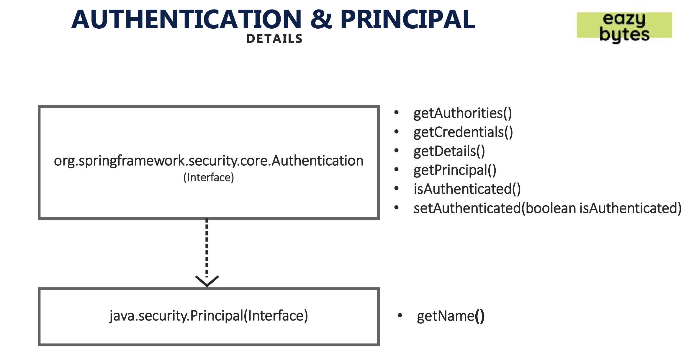
 
 ### Implementing Custom AuthenticationProvider
* To learn how we can add our own custom implementation of AuthenticationProvider, watch this [tutorial](https://www.udemy.com/course/spring-security-zero-to-master/learn/lecture/22632775#content).

## Setting up UI and connecting it with backend
* See commit #**8307a1f2d677ea74f8b31e89adc2462d86d193a3** for more info.
* Also need to add additional data to the DB.
```sql
CREATE TABLE `users` (
`id` INT NOT NULL AUTO_INCREMENT,
`username` VARCHAR(45) NOT NULL,
`password` VARCHAR(45) NOT NULL,
`enabled` INT NOT NULL,
PRIMARY KEY (`id`));

CREATE TABLE `authorities` (
  `id` int NOT NULL AUTO_INCREMENT,
  `username` varchar(45) NOT NULL,
  `authority` varchar(45) NOT NULL,
  PRIMARY KEY (`id`));

INSERT IGNORE INTO `users` VALUES (NULL, 'happy', '12345', '1');
INSERT IGNORE INTO `authorities` VALUES (NULL, 'happy', 'write');

CREATE TABLE `customer` (
  `customer_id` int NOT NULL AUTO_INCREMENT,
  `name` varchar(100) NOT NULL,
  `email` varchar(100) NOT NULL,
  `mobile_number` varchar(20) NOT NULL,
  `pwd` varchar(500) NOT NULL,
  `role` varchar(100) NOT NULL,
  `create_dt` date DEFAULT NULL,
  PRIMARY KEY (`customer_id`)
);

INSERT INTO `customer` (`name`,`email`,`mobile_number`, `pwd`, `role`,`create_dt`)
 VALUES ('Happy','happy@example.com','9876548337', '$2y$12$oRRbkNfwuR8ug4MlzH5FOeui.//1mkd.RsOAJMbykTSupVy.x/vb2', 'admin',CURDATE());
-- pwd = 12345 
CREATE TABLE `accounts` (
  `customer_id` int NOT NULL,
   `account_number` int NOT NULL,
  `account_type` varchar(100) NOT NULL,
  `branch_address` varchar(200) NOT NULL,
  `create_dt` date DEFAULT NULL,
  PRIMARY KEY (`account_number`),
  KEY `customer_id` (`customer_id`),
  CONSTRAINT `customer_ibfk_1` FOREIGN KEY (`customer_id`) REFERENCES `customer` (`customer_id`) ON DELETE CASCADE
);

INSERT INTO `accounts` (`customer_id`, `account_number`, `account_type`, `branch_address`, `create_dt`)
 VALUES (1, 186576, 'Savings', '123 Main Street, New York', CURDATE());
 
CREATE TABLE `account_transactions` (
  `transaction_id` varchar(200) NOT NULL,
  `account_number` int NOT NULL,
  `customer_id` int NOT NULL,
  `transaction_dt` date NOT NULL,
  `transaction_summary` varchar(200) NOT NULL,
  `transaction_type` varchar(100) NOT NULL,
  `transaction_amt` int NOT NULL,
  `closing_balance` int NOT NULL,
  `create_dt` date DEFAULT NULL,
  PRIMARY KEY (`transaction_id`),
  KEY `customer_id` (`customer_id`),
  KEY `account_number` (`account_number`),
  CONSTRAINT `accounts_ibfk_2` FOREIGN KEY (`account_number`) REFERENCES `accounts` (`account_number`) ON DELETE CASCADE,
  CONSTRAINT `acct_user_ibfk_1` FOREIGN KEY (`customer_id`) REFERENCES `customer` (`customer_id`) ON DELETE CASCADE
);

INSERT INTO `account_transactions` (`transaction_id`, `account_number`, `customer_id`, `transaction_dt`, `transaction_summary`, `transaction_type`,`transaction_amt`, 
`closing_balance`, `create_dt`)  VALUES (UUID(), 186576, 1, CURDATE()-1, 'Amazon.com', 'Withdrawal', 100,34900,CURDATE()-1);
 
 INSERT INTO `account_transactions` (`transaction_id`, `account_number`, `customer_id`, `transaction_dt`, `transaction_summary`, `transaction_type`,`transaction_amt`, 
`closing_balance`, `create_dt`)  VALUES (UUID(), 186576, 1, CURDATE()-2, 'OnlineTransfer', 'Deposit', 700,35000,CURDATE()-2);

INSERT INTO `account_transactions` (`transaction_id`, `account_number`, `customer_id`, `transaction_dt`, `transaction_summary`, `transaction_type`,`transaction_amt`, 
`closing_balance`, `create_dt`)  VALUES (UUID(), 186576, 1, CURDATE()-3, 'Coffee Shop', 'Withdrawal', 30,34500,CURDATE()-3);

INSERT INTO `account_transactions` (`transaction_id`, `account_number`, `customer_id`, `transaction_dt`, `transaction_summary`, `transaction_type`,`transaction_amt`, 
`closing_balance`, `create_dt`)  VALUES (UUID(), 186576, 1, CURDATE()-4, 'Ebay', 'Withdrawal', 600,34300,CURDATE()-4);

INSERT INTO `account_transactions` (`transaction_id`, `account_number`, `customer_id`, `transaction_dt`, `transaction_summary`, `transaction_type`,`transaction_amt`, 
`closing_balance`, `create_dt`)  VALUES (UUID(), 186576, 1, CURDATE()-5, 'Self Deposit', 'Deposit', 500,34900,CURDATE()-5);

INSERT INTO `account_transactions` (`transaction_id`, `account_number`, `customer_id`, `transaction_dt`, `transaction_summary`, `transaction_type`,`transaction_amt`, 
`closing_balance`, `create_dt`)  VALUES (UUID(), 186576, 1, CURDATE()-6, 'Uber', 'Withdrawal', 100,34400,CURDATE()-6);


CREATE TABLE `loans` (
  `loan_number` int NOT NULL AUTO_INCREMENT,
  `customer_id` int NOT NULL,
  `start_dt` date NOT NULL,
  `loan_type` varchar(100) NOT NULL,
  `total_loan` int NOT NULL,
  `amount_paid` int NOT NULL,
  `outstanding_amount` int NOT NULL,
  `create_dt` date DEFAULT NULL,
  PRIMARY KEY (`loan_number`),
  KEY `customer_id` (`customer_id`),
  CONSTRAINT `loan_customer_ibfk_1` FOREIGN KEY (`customer_id`) REFERENCES `customer` (`customer_id`) ON DELETE CASCADE
);

INSERT INTO `loans` ( `customer_id`, `start_dt`, `loan_type`, `total_loan`, `amount_paid`, `outstanding_amount`, `create_dt`)
 VALUES ( 1, '2020-10-13', 'Home', 200000, 50000, 150000, '2020-10-13');
 
INSERT INTO `loans` ( `customer_id`, `start_dt`, `loan_type`, `total_loan`, `amount_paid`, `outstanding_amount`, `create_dt`)
 VALUES ( 1, '2020-06-06', 'Vehicle', 40000, 10000, 30000, '2020-06-06');
 
INSERT INTO `loans` ( `customer_id`, `start_dt`, `loan_type`, `total_loan`, `amount_paid`, `outstanding_amount`, `create_dt`)
 VALUES ( 1, '2018-02-14', 'Home', 50000, 10000, 40000, '2018-02-14');

INSERT INTO `loans` ( `customer_id`, `start_dt`, `loan_type`, `total_loan`, `amount_paid`, `outstanding_amount`, `create_dt`)
 VALUES ( 1, '2018-02-14', 'Personal', 10000, 3500, 6500, '2018-02-14');

CREATE TABLE `cards` (
  `card_id` int NOT NULL AUTO_INCREMENT,
  `card_number` varchar(100) NOT NULL,
  `customer_id` int NOT NULL,
  `card_type` varchar(100) NOT NULL,
  `total_limit` int NOT NULL,
  `amount_used` int NOT NULL,
  `available_amount` int NOT NULL,
  `create_dt` date DEFAULT NULL,
  PRIMARY KEY (`card_id`),
  KEY `customer_id` (`customer_id`),
  CONSTRAINT `card_customer_ibfk_1` FOREIGN KEY (`customer_id`) REFERENCES `customer` (`customer_id`) ON DELETE CASCADE
);

INSERT INTO `cards` (`card_number`, `customer_id`, `card_type`, `total_limit`, `amount_used`, `available_amount`, `create_dt`)
 VALUES ('4565XXXX4656', 1, 'Credit', 10000, 500, 9500, CURDATE());

INSERT INTO `cards` (`card_number`, `customer_id`, `card_type`, `total_limit`, `amount_used`, `available_amount`, `create_dt`)
 VALUES ('3455XXXX8673', 1, 'Credit', 7500, 600, 6900, CURDATE());
 
INSERT INTO `cards` (`card_number`, `customer_id`, `card_type`, `total_limit`, `amount_used`, `available_amount`, `create_dt`)
 VALUES ('2359XXXX9346', 1, 'Credit', 20000, 4000, 16000, CURDATE());
 
CREATE TABLE `notice_details` (
  `notice_id` int NOT NULL AUTO_INCREMENT,
  `notice_summary` varchar(200) NOT NULL,
  `notice_details` varchar(500) NOT NULL,
  `notic_beg_dt` date NOT NULL,
  `notic_end_dt` date DEFAULT NULL,
  `create_dt` date DEFAULT NULL,
  `update_dt` date DEFAULT NULL,
  PRIMARY KEY (`notice_id`)
);

INSERT INTO `notice_details` ( `notice_summary`, `notice_details`, `notic_beg_dt`, `notic_end_dt`, `create_dt`, `update_dt`)
VALUES ('Home Loan Interest rates reduced', 'Home loan interest rates are reduced as per the goverment guidelines. The updated rates will be effective immediately', 
'2020-10-14', '2020-11-30', CURDATE(), null);

INSERT INTO `notice_details` ( `notice_summary`, `notice_details`, `notic_beg_dt`, `notic_end_dt`, `create_dt`, `update_dt`)
VALUES ('Net Banking Offers', 'Customers who will opt for Internet banking while opening a saving account will get a $50 amazon voucher', 
'2020-10-14', '2020-12-05', CURDATE(), null);

INSERT INTO `notice_details` ( `notice_summary`, `notice_details`, `notic_beg_dt`, `notic_end_dt`, `create_dt`, `update_dt`)
VALUES ('Mobile App Downtime', 'The mobile application of the EazyBank will be down from 2AM-5AM on 12/05/2020 due to maintenance activities', 
'2020-10-14', '2020-12-01', CURDATE(), null);

INSERT INTO `notice_details` ( `notice_summary`, `notice_details`, `notic_beg_dt`, `notic_end_dt`, `create_dt`, `update_dt`)
VALUES ('E Auction notice', 'There will be a e-auction on 12/08/2020 on the Bank website for all the stubborn arrears.Interested parties can participate in the e-auction', 
'2020-10-14', '2020-12-08', CURDATE(), null);
   
INSERT INTO `notice_details` ( `notice_summary`, `notice_details`, `notic_beg_dt`, `notic_end_dt`, `create_dt`, `update_dt`)
VALUES ('Launch of Millennia Cards', 'Millennia Credit Cards are launched for the premium customers of EazyBank. With these cards, you will get 5% cashback for each purchase', 
'2020-10-14', '2020-11-28', CURDATE(), null);

INSERT INTO `notice_details` ( `notice_summary`, `notice_details`, `notic_beg_dt`, `notic_end_dt`, `create_dt`, `update_dt`)
VALUES ('COVID-19 Insurance', 'EazyBank launched an insurance policy which will cover COVID-19 expenses. Please reach out to the branch for more details', 
'2020-10-14', '2020-12-31', CURDATE(), null);

CREATE TABLE `contact_messages` (
  `contact_id` varchar(50) NOT NULL,
  `contact_name` varchar(50) NOT NULL,
  `contact_email` varchar(100) NOT NULL,
  `subject` varchar(500) NOT NULL,
  `message` varchar(2000) NOT NULL,
  `create_dt` date DEFAULT NULL,
  PRIMARY KEY (`contact_id`)
);

```

## Understanding CORs and CSRF
* Especially relevant when working with microservices
### CORS (Cross-Origin Resource Sharing)
* Occurs when two different origins application tries to communicate with each other
* CORS is a protocol that enables scripts running on a browser client to interact with resources from a different origin.
* For example, if a UI app wishes to make an API call running on a different domain, it would be blocked from doing
  so by default due to CORS. So CORS is not a security issue/attack but the default protection provided by browsers to stop sharing the data/communication between different origins.
* "other origins" means the URL being accessed differs from the location that the JavaScript is running from, by
  having:
    * a different scheme (HTTP or HTTPS)
    * a different domain
    * a different port
* But what if there is a legitimate scenario where cross-origin access is desirable or even necessary. For example, in
  our EazyBank application where the UI and backend are hosted on two different ports.
* When a server has been configured correctly to allow cross-origin resource sharing, some special headers will be
  included. Their presence can be used to determine that a request supports CORS. Web browsers can use these
  headers to determine whether a request should continue or fail.
* First the browser sends a pre-flight request to the backend server to determine whether it supports CORS or not. 
  The server can then respond to the pre-flight request with a collection of headers:
    * Access-Control-Allow-Origin: Defines which origins may have access to the resource. A ‘*' represents any origin
    * Access-Control-Allow-Methods: Indicates the allowed HTTP methods for cross-origin requests
    * Access-Control-Allow-Headers: Indicates the allowed request headers for cross-origin requests
    * Access-Control-Allow-Credentials : Indicates whether or not the response to the request can be exposed when the credentials
      flag is true.
    * Access-Control-Max-Age: Defines the expiration time of the result of the cached preflight request
* Before configuring CORs

* After configuring CORs

* Let's look at how we add configuration to resolve this issue:
```java
package com.springsecurity.config;
@Configuration
public class ProjectSecurityConfig extends WebSecurityConfigurerAdapter {
    @Override
    protected void configure(HttpSecurity http) throws Exception {
        http.cors().configurationSource(new CorsConfigurationSource() {
            @Override
            public CorsConfiguration getCorsConfiguration(HttpServletRequest httpServletRequest) {
                CorsConfiguration config = new CorsConfiguration();
                config.setAllowedOrigins(Collections.singletonList("http://localhost:4200"));
                config.setAllowedMethods(Collections.singletonList("*"));
                config.setAllowCredentials(true);
                config.setAllowedHeaders(Collections.singletonList("*"));
                config.setMaxAge(3600L);
                return config;
            }
        });
        // ignore the code below
        http.authorizeRequests((requests) -> {
            ((ExpressionUrlAuthorizationConfigurer.AuthorizedUrl)requests.antMatchers("/myAccount")).authenticated();
            ((ExpressionUrlAuthorizationConfigurer.AuthorizedUrl)requests.antMatchers("/myLoans")).authenticated();
            ((ExpressionUrlAuthorizationConfigurer.AuthorizedUrl)requests.antMatchers("/myCards")).authenticated();
            ((ExpressionUrlAuthorizationConfigurer.AuthorizedUrl)requests.antMatchers("/myBalance")).authenticated();
            ((ExpressionUrlAuthorizationConfigurer.AuthorizedUrl)requests.antMatchers("/contact")).permitAll();
            ((ExpressionUrlAuthorizationConfigurer.AuthorizedUrl)requests.antMatchers("/notices")).permitAll();
        });
        http.formLogin();
        http.httpBasic();
    }

    @Bean
    public PasswordEncoder passwordEncoder() {
        return new BCryptPasswordEncoder();
    }
}
```
### CSRF (Cross-Site Request Forgery)
* Once we get past CORs, if it is a get request we will get pass through successfully, however, if our request method is post, we will run into 403 forbidden error (CSRF errors).
* A typical Cross-Site Request Forgery (CSRF or XSRF) attack aims to perform an operation in a web application on
  behalf of a user without their explicit consent. In general, it doesn't directly steal the user's identity, but it exploits the user to carry out an action without their will.
* Consider a website netflix.com and the attacker’s website travelblog.com. Also assume that the victim is logged in
  and his session is being maintained by cookies. The attacker will:
    * Find out what action he needs to perform on behalf of the victim and find out its endpoint (for example, to change password on netflix.com a POST request is made to the website that contains new password as the parameter)
    * Place HTML code on his website travelblog.com that will imitate a legal request to netflix.com (for example, a form with method as post and a hidden input field that contains the new password).
    * Make sure that the form is submitted by either using “autosubmit” or luring the victim to click on a submit button.
    * 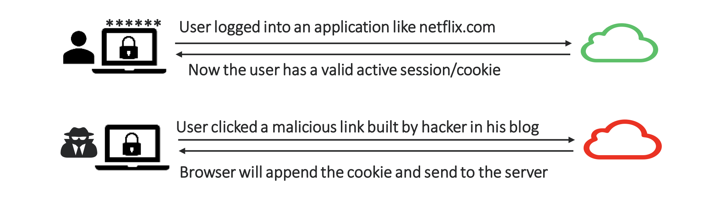
    * When the victim visits travelblog.com and that form is submitted, the victim’s browser makes a request to netflix.com for a password change. Also the browser appends the cookies with the request. The server treats it as a genuine request and resets the victim’s password to the attacker’s supplied value. This way the victim’s account gets taken over by the attacker.
    * There are many proposed ways to implement CSRF protection on server side, among which the use of CSRF tokens is most popular. A CSRF token is a string that is tied to a user’s session but is not submitted automatically. A website proceeds only when it receives a valid CSRF token along with the cookies, since there is no way for an attacker to know a user specific token, the attacker can not perform actions on user’s behalf.
#### Resolving CSRF error
* One way to resolve this error is by disabling it in spring security. 
* This is not recommended
```java
package com.springsecurity.config;
@Configuration
public class ProjectSecurityConfig extends WebSecurityConfigurerAdapter {
        @Override
        protected void configure(HttpSecurity http) throws Exception {
            http.csrf().disable();
        // ignore the comments below
        // configuration to resolve CORS error..
        // authorizing requests..
        }
}
```
* Recommended way to resolve this error is by generating CSRF token
* 
